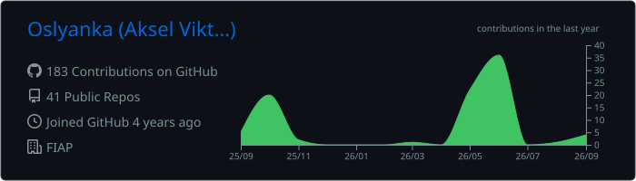
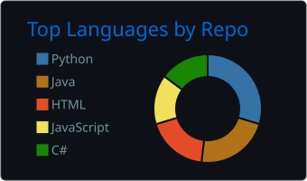
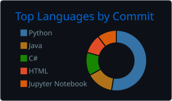
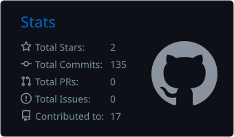
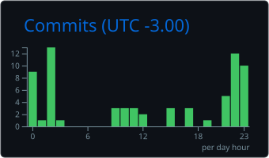

# Hello

I am a <!-- age:start -->21<!-- age:end --> y/o, studying Computer Science in Sao Paulo, Brazil.

I am specially interested in FOSS, Linux and homelab/self-hosting stuff.

## stuff im working with

- backend: Java, Spring Boot, C#, .NET, REST, SQL, JPA, Entity Framework
- frontend: React, TypeScript, JavaScript, HTML/CSS
- testing/automation: unit tests, API tests, GitHub Actions, UiPath
- python: small CLIs, SQLite tools, log/check runners

## projects worth checking out

| project | what it is |
| --- | --- |
| [balcao-de-chamados](https://github.com/Oslyanka/balcao-de-chamados) | Java/Spring Boot API for handling support tickets, with JPA, validation, H2 and controller tests |
| [carteira-de-risco](https://github.com/Oslyanka/carteira-de-risco) | .NET API that calculates portfolio exposure and flags concentration risk |
| [mesa-de-operacoes](https://github.com/Oslyanka/mesa-de-operacoes) | small full stack app with Node/TypeScript, React and a lightweight old-web-ish UI |
| [prova-viva](https://github.com/Oslyanka/prova-viva) | Python runner for testing HTTP endpoints using JSON scenarios |
| [farol-da-rede](https://github.com/Oslyanka/farol-da-rede) | Python/SQLite panel for checking homelab services with HTTP/TCP probes |

## right now

trying to get better at backend engineering, Linux, and running my own infrastructure.

## stats

